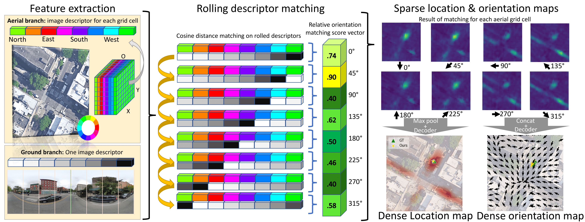

# [T-PAMI 2023] CCVPE: Convolutional Cross-View Pose Estimation
[[`Paper`](https://arxiv.org/pdf/2303.05915v2.pdf)] [[`Demo Video`](http://www.youtube.com/watch?v=9p7bccGZ82Q)] [[`BibTeX`](#citation)]

This work is an extension of ["Visual Cross-View Metric Localization with Dense Uncertainty Estimates, ECCV2022"](https://github.com/tudelft-iv/CrossViewMetricLocalization)



Demo video of per-frame pose estimation on Oxford RobotCar traversals with different weather and lighting conditions

[](http://www.youtube.com/watch?v=9p7bccGZ82Q "CCVPE Demo Video on Oxford RobotCar")


Pose estimation (localization + orientation estimation) on images with different horizontal field-of-view (HFoV). From left to right: HFoV= $360 &deg$, $180 &deg$, $108 &deg$

  


### Abstract
We propose a novel end-to-end method for cross-view pose estimation. Given a ground-level query image and an aerial image that covers the query's local neighborhood, the 3 Degrees-of-Freedom camera pose of the query is estimated by matching its image descriptor to descriptors of local regions within the aerial image. The orientation-aware descriptors are obtained by using a translational equivariant convolutional ground image encoder and contrastive learning. The Localization Decoder produces a dense probability distribution in a coarse-to-fine manner with a novel Localization Matching Upsampling module. A smaller Orientation Decoder produces a vector field to condition the orientation estimate on the localization. Our method is validated on the VIGOR and KITTI datasets, where it surpasses the state-of-the-art baseline by 72% and 36% in median localization error for comparable orientation estimation accuracy. The predicted probability distribution can represent localization ambiguity, and enables rejecting possible erroneous predictions.
Without re-training, the model can infer on ground images with different field of views and utilize orientation priors if available. On the Oxford RobotCar dataset, our method can reliably estimate the ego-vehicle's pose over time, achieving a median localization error under 1 meter and a median orientation error of around 1 degree at 14 FPS.

### Datasets
VIGOR dataset can be found at https://github.com/Jeff-Zilence/VIGOR.
We use the revised ground truth from https://github.com/tudelft-iv/SliceMatch <br />
KITTI dataset can be found at https://github.com/shiyujiao/HighlyAccurate <br />
For Oxford RobotCar, the aerial image is provided by https://github.com/tudelft-iv/CrossViewMetricLocalization, the ground images are from https://robotcar-dataset.robots.ox.ac.uk/datasets/

### Models
Our trained models are available at: https://surfdrive.surf.nl/files/index.php/s/cbyPn7NQoOOzlqp

### Training and testing
Training or testing on VIGOR dataset: <br />
samearea split: `python train_VIGOR.py --area samearea` <br />
crossarea split: `python train_VIGOR.py --area crossarea` <br />
For testing, add argument `--training False` <br />
For testing with an orientation prior that contains up to $&plusmn X &deg$ noise, e.g. $&plusmn 72 &deg$, add the argument `--ori_noise 72`. $X=0$ corresponds to testing with known orientation <br />
For testing with images with a limited HFoV, e.g. $180 &deg$, add the argument `--FoV 180`

Training on KITTI dataset: `python train_KITTI.py` <br />
For testing, add argument `--training False` <br />
For training or testing with an orientation prior, e.g. $&plusmn 10 &deg$, add argument `--rotation_range 10` <br />
We also provide the model trained with $&plusmn 10 &deg$ orientation prior, please change the `test_model_path` in `train_KITTI.py`

Training or testing on Oxford RobotCar dataset: <br />
`python train_OxfordRobotCar.py` or `python train_OxfordRobotCar.py --training False`

### Visualize qualitative results
Visualize qualitative results on VIGOR same-area or cross-area test set: <br />
`python visualize_qualitative_results_VIGOR.py --area samearea --ori_prior 180 --idx 0` <br />
`idx`: image index in VIGOR test set <br />
`ori_prior`: $X$ means assuming known orientation with $&plusmn X &deg$ noise, $180$ means no orientation prior

### Citation
```
@article{xia2023convolutional,
  title={Convolutional Cross-View Pose Estimation},
  author={Xia, Zimin and Booij, Olaf and Kooij, Julian FP},
  journal={arXiv preprint arXiv:2303.05915},
  year={2023}
}
```
